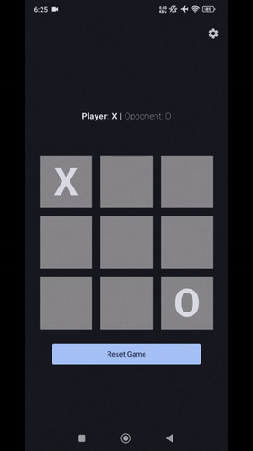
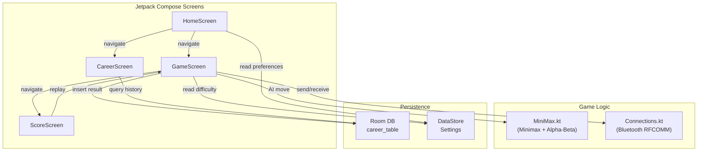

# Tic-Tac-Toe — Multiplayer Android App

> A feature-complete Tic-Tac-Toe game for Android with Bluetooth multiplayer, an AI opponent powered by Minimax + Alpha-Beta pruning, persistent career stats, and a fully reactive Jetpack Compose UI.

**Scored 125/120** (extra credit) as a collaborative group project.

---

## Overview

This Android app goes well beyond a basic Tic-Tac-Toe implementation. It supports three distinct game modes — including real-time peer-to-peer play across two physical devices over Bluetooth Classic — and backs every match with a local Room database for career history. The AI opponent plays optimally at Hard difficulty using a depth-tracked Minimax algorithm with Alpha-Beta pruning, with randomized fallbacks for Easy and Medium difficulty.

The entire UI is built declaratively with Jetpack Compose, navigation is handled by the Navigation component, and all persistent state (settings, game results) uses Jetpack DataStore and Room.

---

## Demo



Full walkthroughs: [Video 1](https://www.youtube.com/watch?v=HLWJYrPlGiY) · [Video 2](https://www.youtube.com/watch?v=zkkfVmkCaVw) · [Video 3](https://www.youtube.com/watch?v=ZHi_0iyyxZk)

---

## Highlights

- **Bluetooth P2P multiplayer** — full RFCOMM socket lifecycle management including device discovery, bonding, connection with retry, keepalive heartbeats, graceful disconnect handling, and JSON game-state sync.
- **Minimax + Alpha-Beta pruning AI** — depth-aware scoring (`±10 - depth`) ensures the AI finds the earliest win and delays the latest loss; Medium difficulty randomly alternates between random and optimal moves per turn.
- **Animated win detection** — a Canvas-drawn line animates from the start to end cell of the winning combination using `Animatable` and a 2-second tween.
- **Draw prediction** — detects inevitable draws before the board is full by checking whether any remaining winning combination is still achievable.
- **Persistent career stats** — every game result, mode, difficulty, and timestamp is stored in a Room database and surfaced on the Career screen.
- **Reactive settings** — difficulty, dark/light theme, volume, and turn preference are persisted via DataStore and consumed as Kotlin `Flow`s throughout the app.

---

## Game Modes

| Mode | Description |
|------|-------------|
| **vs Computer** | Play against the AI; difficulty adjustable mid-session via Settings |
| **1 Device** | Pass-and-play for two humans on one phone |
| **2 Devices** | Real-time Bluetooth multiplayer across two Android devices |

---

## Features

**AI**
- Three difficulty levels: Easy (random), Medium (50/50 random vs optimal per turn), Hard (always optimal)
- Runs asynchronously on `Dispatchers.IO` to keep the UI responsive; a 1-second "thinking" delay is added for UX

**Bluetooth Multiplayer**
- Scans for nearby and bonded devices; initiates bonding automatically if not yet paired
- Server accepts incoming connections via `BluetoothServerSocket` (RFCOMM); client connects via `BluetoothSocket`
- Sends keepalive strings every 8 seconds to detect silent disconnects
- Game state serialized as JSON with Gson; turn counter used to reconcile race conditions
- Multi-stage setup flow: `Idle → NoService → Preference → Initialised → GameStart → GameOver`

**Game Screen**
- Portrait-locked for gameplay, flexible orientation on other screens
- Highlighted active-player indicator; "Computer thinking…" label during AI turns
- Reset button available at any time before game over
- Animated red strike-through line drawn over the winning cells

**Career & History**
- Room database with a `career_table` storing winner, game mode, difficulty (nullable), and date
- Type converters for custom enum and `Date` fields

**Settings**
- AI difficulty, dark/light theme toggle, master volume slider, default turn preference
- All settings persisted via Jetpack DataStore; changes are reactive across all screens

**Audio**
- Six sound effects: game start, player tap, opponent tap, win, fail, draw
- Volume controlled globally via the settings slider

---

## Tech Stack

| Layer | Technology | Purpose |
|-------|------------|---------|
| Language | Kotlin | Primary language |
| UI | Jetpack Compose + Material3 | Declarative UI, theming |
| Navigation | Navigation Compose | Screen routing, back-stack management |
| AI | Custom Minimax + Alpha-Beta | Optimal AI opponent |
| Multiplayer | Android Bluetooth Classic (RFCOMM) | P2P two-device gameplay |
| Data sync | Gson | JSON serialization of game state over Bluetooth |
| Persistence | Room 2.6 | Game history / career stats |
| Settings | DataStore Preferences | Difficulty, theme, volume, turn preference |
| DI | Hilt 2.45 | Dependency injection |
| Audio | AndroidX Media | Sound effects |
| State | Kotlin StateFlow / Compose State | Reactive UI state |
| Build | Gradle KTS + AGP 8.6 | Build system |

---

## Architecture



---

## How It Works

1. **Home screen** — user selects a game mode. For vs-Computer and 1-Device modes, a turn-preference dialog appears (or uses the saved preference). For 2-Devices, Bluetooth permissions are requested, Bluetooth is enabled if off, then a device-picker dialog scans for nearby devices.
2. **Bluetooth handshake** — connecting device acts as client (RFCOMM connect); other device's `AcceptThread` accepts the socket. Both exchange a `DataModel` JSON payload to negotiate player identities and turn order.
3. **Gameplay loop** — `GameScreen` tracks a 3×3 grid as `Array<Array<GridEntry>>`. On each turn change, `LaunchedEffect` triggers the AI (`runAITurn` on `Dispatchers.IO`) or sends the board state to the peer device. Incoming Bluetooth data is deserialized and applied to the local grid.
4. **Win / draw detection** — all 8 winning combinations are checked after every move. Draw is detected by checking that no remaining combination can still be won by either player.
5. **Animated result** — `MatchLineOverlay` uses `Animatable` to draw a strike line over the winning cells over 2 seconds, then navigates to `ScoreScreen`.
6. **Persistence** — `AddScoreViewModel` inserts a `DataEntity` into Room on every game conclusion. Career screen queries and displays the full history.

---

## Setup

### Prerequisites
- Android Studio Hedgehog or later
- Android device or emulator running API 26+
- Two physical Android devices with Bluetooth for 2-Device mode

### Install & Run

```bash
# Clone the repo
git clone https://github.com/<your-username>/Tic-Tac-Toe.git
cd Tic-Tac-Toe

# Open in Android Studio, then:
# Build > Make Project
# Run > Run 'app' on a connected device
```

No API keys or environment variables required.

### Two-Device Multiplayer Setup
1. Install the app on both devices.
2. Enable Bluetooth on both. Location permission is required for Bluetooth scanning on Android 10 and below.
3. On one device, tap **Play on 2-Devices** → select the other device from the list.
4. The app will prompt to pair if not already bonded.
5. Once connected, both players select a turn preference and the game starts.

---

## Key Decisions

| Decision | Rationale | Tradeoff |
|----------|-----------|----------|
| Bluetooth Classic (RFCOMM) over BLE | Reliable, stream-oriented socket API; easier full-duplex game state transfer | Higher battery use vs BLE; requires Location permission on older Android versions |
| Minimax with Alpha-Beta pruning | Guarantees optimal play; pruning reduces the search tree significantly for a 3×3 board | Overkill for 3×3 but demonstrates algorithmic correctness and extensibility |
| Depth-aware scoring (`±10 - depth`) | Prefers earlier wins and delays losses, making the AI feel natural rather than indifferent to speed | Slightly more complex scoring logic |
| Keepalive heartbeat every 8s | Detects silent Bluetooth disconnects that do not fire `ACTION_ACL_DISCONNECTED` | Adds background thread churn; handled cleanly via `Handler.postDelayed` with removal on cancel |
| Turn counter for Bluetooth sync | Resolves race conditions where both devices send state simultaneously by accepting the higher turn count | Does not handle all edge cases of concurrent sends, but sufficient for the game's timing |
| Room + DataStore (no cloud) | Local-only persistence keeps the app offline-first with no backend dependency | Career stats are device-local; no cross-device history |
| Portrait lock on `GameScreen` | Prevents layout recomposition and grid state disruption mid-game | Other screens remain flexible-orientation |

---

## Innovation / Notable Work

- **Full Bluetooth lifecycle management** — `Connections.kt` handles the complete arc: permission checking, BroadcastReceiver registration/deregistration, `AcceptThread` server socket, `ConnectedThread` I/O loop, retry logic for connection setup (`retryTask`), and graceful teardown. This is non-trivial on Android and the code handles edge cases like devices that disconnect without firing the standard ACL event.
- **Multi-stage Bluetooth game setup protocol** — a custom state machine (`OnlineSetupStage`) coordinates identity exchange, turn-preference negotiation, and game start across two devices with no central server.
- **Compose Canvas animation** — the winning-line overlay is drawn directly on a `Canvas` composable using computed cell-center offsets and animated via `Animatable`, avoiding any third-party animation library.
- **Inevitable draw detection** — rather than waiting for a full board, the game checks after every move whether any winning combination is still reachable, and calls a draw as soon as it becomes impossible for either player to win.

---

## About

Built as a university group project, this app was awarded **125 out of 120 points** (extra credit). The project explores applied algorithms (Minimax), Android system APIs (Bluetooth Classic, Permissions), and modern Android architecture patterns (Compose, Room, DataStore, Hilt) in a single cohesive application.
